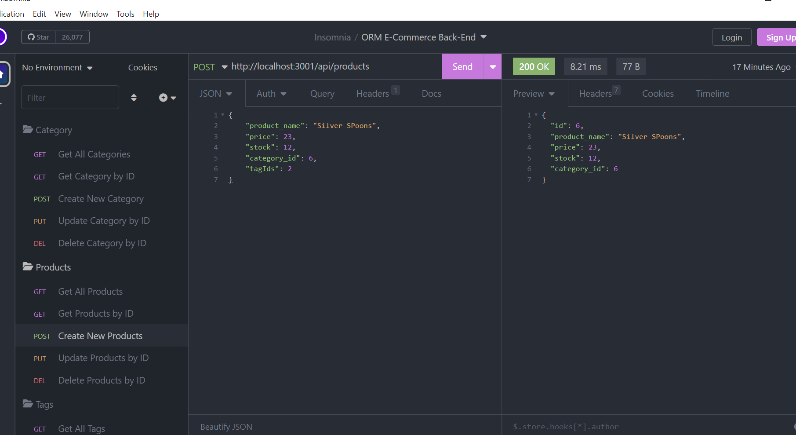

# NoSQL or No-Social
    
  ## Table of Contents
  - [Description](#description)
  - [Installation](#installation)
  - [Usage](#usage)
  - [Video Walkthrough](#video-walkthrough)
  - [Screenshot](#screenshot)
  - [Questions](#questions)
    
  ## Description
  This project was created to display my knowledge of NoSQL databases and particularly organizing and utilizing them with Mongoose and MongoDB. There is no UI and is meant to be the backend logic and shell for building out a social network. All the routes are there and the database sets itself up when running.
    
  ## Installation
  
  To properly run this program, node packages must be installed first. This application runs on Express and Mongoose; both are already dependencies so just run npm install and everything should properly do so. Once everything is downloaded, run npm start and the proccesses will be up and running. There is no interface, so to interact you must run through the paths in an API tester like Insomnia.
    
  ## Usage

  Use this application as a base for a simple social network. You can add Users and Friends, then share comments and even reactions to those comments all through the provided backend. If you were to add a proper UI, this would shape up into something nice. If it gets real big, my contact info is below and I am all for sharing!
  
  
  ## Video Walkthrough

  [Click here to watch a test!](https://app.castify.com/view/b802596b-93a8-4e7f-97cd-bc43df4a28d8)
  
  ## Screenshot

  
    
  ## Questions
  If you need any more information on using this application, my email is simplererstone@gmail.com.
  My GitHub profile can be located here - >  [simplerer](https://github.com/simplerer)  < -